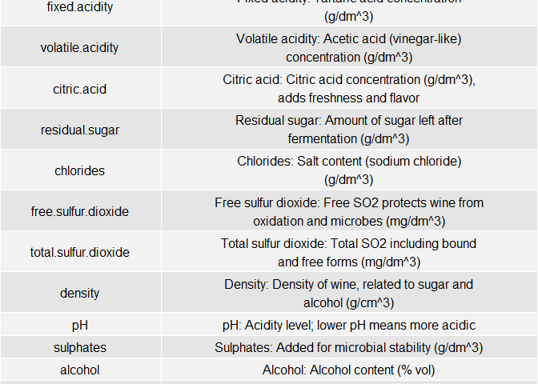

README
================

## 1. Business Understanding

In this project, the objective is to identify the chemical characteristics that influence wine quality. A wine producer has asked for help in understanding what factors contribute to a good quality wine, using data from the UCI Wine Quality Dataset. Wine quality is typically assessed by trained sensory analysts and can depend on several chemical features such as acidity, alcohol content, sugar levels, and sulfur dioxide levels.

Based on background research and intuition, I hypothesize that features like higher alcohol content and balanced acidity levels may correlate positively with better wine quality. On the other hand, extremely high levels of certain components like sulfur dioxide may negatively affect taste and thus reduce quality. Through exploratory data analysis and statistical testing, I aim to extract non-obvious insights about what makes a wine “good” or “bad” according to the dataset.

## 2. Data Understanding

In this section, we load the red wine dataset and explore its structure.

    ##   fixed.acidity volatile.acidity citric.acid residual.sugar chlorides
    ## 1           7.0             0.27        0.36           20.7     0.045
    ## 2           6.3             0.30        0.34            1.6     0.049
    ## 3           8.1             0.28        0.40            6.9     0.050
    ## 4           7.2             0.23        0.32            8.5     0.058
    ## 5           7.2             0.23        0.32            8.5     0.058
    ## 6           8.1             0.28        0.40            6.9     0.050
    ##   free.sulfur.dioxide total.sulfur.dioxide density   pH sulphates alcohol
    ## 1                  45                  170  1.0010 3.00      0.45     8.8
    ## 2                  14                  132  0.9940 3.30      0.49     9.5
    ## 3                  30                   97  0.9951 3.26      0.44    10.1
    ## 4                  47                  186  0.9956 3.19      0.40     9.9
    ## 5                  47                  186  0.9956 3.19      0.40     9.9
    ## 6                  30                   97  0.9951 3.26      0.44    10.1
    ##   quality
    ## 1       6
    ## 2       6
    ## 3       6
    ## 4       6
    ## 5       6
    ## 6       6

    ##   fixed.acidity volatile.acidity citric.acid residual.sugar chlorides
    ## 1           7.4             0.70        0.00            1.9     0.076
    ## 2           7.8             0.88        0.00            2.6     0.098
    ## 3           7.8             0.76        0.04            2.3     0.092
    ## 4          11.2             0.28        0.56            1.9     0.075
    ## 5           7.4             0.70        0.00            1.9     0.076
    ## 6           7.4             0.66        0.00            1.8     0.075
    ##   free.sulfur.dioxide total.sulfur.dioxide density   pH sulphates alcohol
    ## 1                  11                   34  0.9978 3.51      0.56     9.4
    ## 2                  25                   67  0.9968 3.20      0.68     9.8
    ## 3                  15                   54  0.9970 3.26      0.65     9.8
    ## 4                  17                   60  0.9980 3.16      0.58     9.8
    ## 5                  11                   34  0.9978 3.51      0.56     9.4
    ## 6                  13                   40  0.9978 3.51      0.56     9.4
    ##   quality
    ## 1       5
    ## 2       5
    ## 3       5
    ## 4       6
    ## 5       5
    ## 6       5

The columns of the wine dataset represent a mix of physicochemical properties and a sensory-based quality score. Most features, such as fixed acidity, volatile acidity, citric acid, residual sugar, chlorides, free sulfur dioxide, total sulfur dioxide, density, pH, sulphates, and alcohol, are continuous numerical variables measured on a ratio scale. These values have a true zero and support meaningful arithmetic operations, making them suitable for statistical modeling and correlation analysis. The final column, quality, is a subjective score assigned by wine tasters on a scale from 0 to 10. This variable is ordinal, as it reflects a ranked assessment of wine quality but does not guarantee equal intervals between score values.

 For white whine , we can visualize the first few enties

 \##Exploratory Data Analysis

To explore and compare the red and white wine datasets, we begin by posing several guiding questions and hypotheses. Alcohol is a key factor in determining the body and perceived strength of wine, and different fermentation practices or grape varietals could result in differences in alcohol levels. A histogram allows us to visualize the shape, central tendency, and spread of alcohol content within each wine type, helping us assess whether there is a notable difference in average alcohol levels or variability between red and white wines. We assume that White wines have a higher average alcohol content than red wines.

 The distribution of alcohol content differs noticeably between red and white wines. White wines tend to have a wider range and slightly higher average alcohol levels, often peaking around 10.5% to 11.5%, while red wines cluster more tightly around 9.5% to 10.5%. Both distributions are right-skewed, meaning that a small number of wines have significantly higher alcohol content than the average. This suggests that while most wines fall within a moderate alcohol range, white wines are more likely to include higher-alcohol varieties, which may influence perceived sweetness and quality.

Next lets look at the distribution of ph levels.Since acidity plays a significant role in wine freshness and microbial stability, and white wines are typically crafted to retain more acidity, we expect them to have a lower pH. The histogram helps us determine whether pH is a useful discriminating factor between red and white wines, and whether the differences in acidity are substantial enough to consider in quality evaluation or classification.  The distribution of pH values reveals notable differences between red and white wines. White wines generally exhibit lower pH values, indicating higher acidity, with the bulk of observations falling between 3.0 and 3.3. In contrast, red wines tend to have higher pH values, mostly in the range of 3.3 to 3.5, reflecting lower acidity. Both distributions are relatively unimodal and slightly skewed left, though white wine pH has a sharper peak, suggesting more consistency in acidity levels. These pH differences align with winemaking practices: white wines are often preserved with higher acidity for freshness, while red wines undergo longer fermentation and aging, allowing for a higher pH.

Another important factor is the resudual sugar distribution.Residual sugar affects the sweetness and mouthfeel of wine. By plotting a histogram of residual sugar, we aim to test whether white wines tend to be sweeter — either by design (e.g., producing off-dry styles) or due to fermentation control. This plot helps visualize skewness (especially in white wines), identify outliers, and compare sugar levels between the two types.  The distribution of residual sugar is markedly different between red and white wines. White wines exhibit a wider and more positively skewed distribution, with most values clustered between 1 and 6 g/dm³, but with a long right tail extending beyond 20 g/dm³. This suggests that some white wines retain significant sweetness, which may reflect stylistic choices such as producing off-dry or semi-sweet varieties. In contrast, red wines have a tighter, more symmetrical distribution, mostly concentrated below 4 g/dm³, indicating drier profiles with less residual sugar overall. The presence of high-sugar outliers in white wines may influence perceptions of sweetness and balance, and could also affect correlations with density, alcohol, and quality.

  Sulphates play a critical role in winemaking as preservatives that help prevent oxidation and microbial spoilage, which can directly affect wine stability and shelf life. Because of this, we are interested in understanding how sulphate concentrations vary between red and white wines. Our hypothesis is that white wines contain higher levels of sulphates than red wines, due to their increased sensitivity to spoilage and the need for freshness preservation. To test this, we use a histogram, which allows us to examine the full distribution of sulphate levels across both wine types, The histogram shows that white wines generally have higher sulphate concentrations than red wines, with peaks around 0.5 to 0.6 g/dm³. In contrast, red wines tend to cluster around lower sulphate values, typically between 0.3 and 0.5 g/dm³. This suggests that sulphates are used more intensively in white wines, likely due to their role in preserving freshness and microbial stability, which are more critical in lighter, more delicate wine styles.  The box plot comparing wine quality scores for red and white wines reveals subtle but meaningful differences. Both types have quality ratings that generally range from 3 to 8, but white wines show a slightly higher median score and a narrower interquartile range (IQR), suggesting more consistency in quality. Red wines, while overlapping in score range, display greater variability and more visible outliers on the lower end, indicating occasional lower-quality batches.

To better understand what influences the perceived quality of wine, it is essential to examine how key chemical properties relate to wine quality scores. Variables such as alcohol content, volatile acidity, sulphates, and residual sugar are known to impact the sensory profile and overall acceptability of wine. By analyzing their correlation with quality, we aim to identify which factors most strongly predict or affect wine quality, and whether these relationships differ between red and white wine. These insights not only inform our statistical modeling strategies but also deepen our understanding of the underlying chemistry that distinguishes higher-quality wines from lower-rated ones.

 The boxplotS show a positive relationship between alcohol content and quality for both red and white wines. Higher quality scores are associated with higher median alcohol levels, particularly evident in white wines. This suggests that alcohol is a strong indicator of quality, likely because it reflects better fermentation control and riper grapes.They also reveal a slight negative trend for pH, where higher-quality wines tend to have slightly lower pH values, indicating more acidity. This pattern is more evident in white wines, which are generally more acidic. However, the relationship is relatively weak, suggesting pH alone is not a strong determinant of perceived quality.

Sulphates show a mild positive trend with quality, with slightly higher values seen in better-rated wines. The relationship is more visible in white wines, where higher quality levels have increased sulphate concentrations. This could suggest that sulphates, which act as preservatives, may contribute to improved stability and quality perception.

There is a negative association between volatile acidity and quality, especially for red wines. Wines with lower quality scores tend to have higher volatile acidity, which decreases steadily as quality improves. This supports the idea that high volatile acidity — often linked to spoilage — negatively impacts the sensory appeal of wine. The relationship between residual sugar and quality is less clear and inconsistent across wine types. White wines display more variation in sugar levels, but high residual sugar does not consistently align with high or low quality scores. This indicates that residual sugar is not a strong standalone predictor of wine quality and may reflect stylistic preferences rather than objective quality.

    ## Warning in cor.test.default(all_vals, quality_vals, method = "spearman"):
    ## Cannot compute exact p-value with ties
    ## Warning in cor.test.default(all_vals, quality_vals, method = "spearman"):
    ## Cannot compute exact p-value with ties
    ## Warning in cor.test.default(all_vals, quality_vals, method = "spearman"):
    ## Cannot compute exact p-value with ties
    ## Warning in cor.test.default(all_vals, quality_vals, method = "spearman"):
    ## Cannot compute exact p-value with ties
    ## Warning in cor.test.default(all_vals, quality_vals, method = "spearman"):
    ## Cannot compute exact p-value with ties

<table class="table table-striped table-hover table-condensed" style="width: auto !important; ">

<caption>

Statistical Test Results for Wine Features
</caption>

<thead>

<tr>

<th style="text-align:left;">

Feature
</th>

<th style="text-align:right;">

T_Test_p
</th>

<th style="text-align:right;">

Wilcoxon_p
</th>

<th style="text-align:right;">

Spearman_rho
</th>

<th style="text-align:right;">

Spearman_p
</th>

</tr>

</thead>

<tbody>

<tr>

<td style="text-align:left;">

alcohol
</td>

<td style="text-align:right;">

0.0043
</td>

<td style="text-align:right;">

0.1818
</td>

<td style="text-align:right;">

0.4469
</td>

<td style="text-align:right;">

0.0000
</td>

</tr>

<tr>

<td style="text-align:left;">

volatile.acidity
</td>

<td style="text-align:right;">

0.0000
</td>

<td style="text-align:right;">

0.0000
</td>

<td style="text-align:right;">

-0.2578
</td>

<td style="text-align:right;">

0.0000
</td>

</tr>

<tr>

<td style="text-align:left;">

sulphates
</td>

<td style="text-align:right;">

0.0000
</td>

<td style="text-align:right;">

0.0000
</td>

<td style="text-align:right;">

0.0298
</td>

<td style="text-align:right;">

0.0162
</td>

</tr>

<tr>

<td style="text-align:left;">

residual.sugar
</td>

<td style="text-align:right;">

0.0000
</td>

<td style="text-align:right;">

0.0000
</td>

<td style="text-align:right;">

-0.0169
</td>

<td style="text-align:right;">

0.1734
</td>

</tr>

<tr>

<td style="text-align:left;">

pH
</td>

<td style="text-align:right;">

0.0000
</td>

<td style="text-align:right;">

0.0000
</td>

<td style="text-align:right;">

0.0325
</td>

<td style="text-align:right;">

0.0087
</td>

</tr>

</tbody>

</table>
