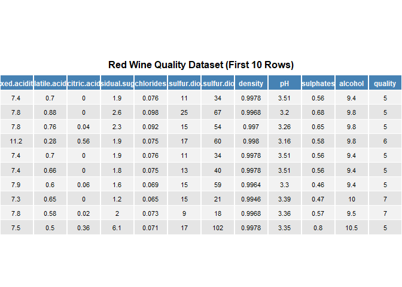
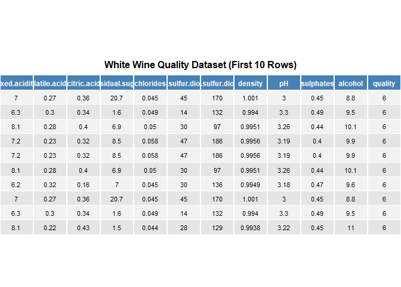

Chemical Determinants of Wine Quality: A Data-Driven Analysis Using the UCI Wine Dataset
================
Maurice Otieno, Wanos Bahiru, Biose Ugbo

## 1. Business Understanding

In this project, the objective is to identify the chemical characteristics that influence wine quality. A wine producer has asked for help in understanding what factors contribute to a good quality wine, using data from the UCI Wine Quality Dataset. Wine quality is typically assessed by trained sensory analysts and can depend on several chemical features such as acidity, alcohol content, sugar levels, and sulfur dioxide levels.

Based on background research and intuition, I hypothesize that features like higher alcohol content and balanced acidity levels may correlate positively with better wine quality. On the other hand, extremely high levels of certain components like sulfur dioxide may negatively affect taste and thus reduce quality. Through exploratory data analysis and statistical testing, I aim to extract non-obvious insights about what makes a wine “good” or “bad” according to the dataset.

## 2. Data Understanding

This analysis is based on the UCI Wine Quality Data Set, which provides physicochemical and quality-related attributes for red and white variants of Portuguese “Vinho Verde” wine. The dataset includes chemical measurements such as alcohol, acidity, sugar, and sulfur dioxide levels, along with quality scores assigned by trained sensory panels. It was accessed from the UCI Machine Learning Repository, a widely used source for open datasets in applied machine learning and data science research. You can find the dataset here:[UCI Wine Quality Data Set](https://archive.ics.uci.edu/ml/datasets/wine+quality).

Next we load the red wine dataset and explore its structure. The red and white wine datasets from the UCI Wine Quality Data Set were first loaded separately and then combined into a single dataset with an added type column to indicate wine variety. Initial inspection showed that the data contained no missing values and all variables were already numeric, eliminating the need for imputation or type conversion. The quality variable, which represents the wine’s rating by sensory analysts, was preserved in both numeric form (for correlation analysis) and as an ordered factor (for boxplots and group comparisons). No outliers were removed, as visual inspections of distributions indicated that extreme values were within realistic chemical ranges. Overall, the dataset required minimal cleaning and was ready for analysis after labeling, verification, and structure alignment.

    ## Number of red_wine samples: 1599

    ## Number of red_wine features: 12

    ## Feature names and types:

    ## 
    ## Red Wine Data Summary:

    ##                               Feature_red Type_red Measurement_red
    ## fixed.acidity               fixed.acidity  numeric           Ratio
    ## volatile.acidity         volatile.acidity  numeric           Ratio
    ## citric.acid                   citric.acid  numeric           Ratio
    ## residual.sugar             residual.sugar  numeric           Ratio
    ## chlorides                       chlorides  numeric           Ratio
    ## free.sulfur.dioxide   free.sulfur.dioxide  numeric           Ratio
    ## total.sulfur.dioxide total.sulfur.dioxide  numeric           Ratio
    ## density                           density  numeric           Ratio
    ## pH                                     pH  numeric        Interval
    ## sulphates                       sulphates  numeric           Ratio
    ## alcohol                           alcohol  numeric           Ratio
    ## quality                           quality  integer         Ordinal

    ## 
    ## Numeric Summary Statistics (Red Wine):

    ##  fixed.acidity   volatile.acidity  citric.acid    residual.sugar  
    ##  Min.   : 4.60   Min.   :0.1200   Min.   :0.000   Min.   : 0.900  
    ##  1st Qu.: 7.10   1st Qu.:0.3900   1st Qu.:0.090   1st Qu.: 1.900  
    ##  Median : 7.90   Median :0.5200   Median :0.260   Median : 2.200  
    ##  Mean   : 8.32   Mean   :0.5278   Mean   :0.271   Mean   : 2.539  
    ##  3rd Qu.: 9.20   3rd Qu.:0.6400   3rd Qu.:0.420   3rd Qu.: 2.600  
    ##  Max.   :15.90   Max.   :1.5800   Max.   :1.000   Max.   :15.500  
    ##    chlorides       free.sulfur.dioxide total.sulfur.dioxide    density      
    ##  Min.   :0.01200   Min.   : 1.00       Min.   :  6.00       Min.   :0.9901  
    ##  1st Qu.:0.07000   1st Qu.: 7.00       1st Qu.: 22.00       1st Qu.:0.9956  
    ##  Median :0.07900   Median :14.00       Median : 38.00       Median :0.9968  
    ##  Mean   :0.08747   Mean   :15.87       Mean   : 46.47       Mean   :0.9967  
    ##  3rd Qu.:0.09000   3rd Qu.:21.00       3rd Qu.: 62.00       3rd Qu.:0.9978  
    ##  Max.   :0.61100   Max.   :72.00       Max.   :289.00       Max.   :1.0037  
    ##        pH          sulphates         alcohol         quality     
    ##  Min.   :2.740   Min.   :0.3300   Min.   : 8.40   Min.   :3.000  
    ##  1st Qu.:3.210   1st Qu.:0.5500   1st Qu.: 9.50   1st Qu.:5.000  
    ##  Median :3.310   Median :0.6200   Median :10.20   Median :6.000  
    ##  Mean   :3.311   Mean   :0.6581   Mean   :10.42   Mean   :5.636  
    ##  3rd Qu.:3.400   3rd Qu.:0.7300   3rd Qu.:11.10   3rd Qu.:6.000  
    ##  Max.   :4.010   Max.   :2.0000   Max.   :14.90   Max.   :8.000

    ## Number of White wine samples: 4898

    ## Number of white wine features: 12

    ## Feature names and types:

    ## 
    ## White Wine Data Summary:

    ##                             Feature_white Type_white Measurement_white
    ## fixed.acidity               fixed.acidity    numeric             Ratio
    ## volatile.acidity         volatile.acidity    numeric             Ratio
    ## citric.acid                   citric.acid    numeric             Ratio
    ## residual.sugar             residual.sugar    numeric             Ratio
    ## chlorides                       chlorides    numeric             Ratio
    ## free.sulfur.dioxide   free.sulfur.dioxide    numeric             Ratio
    ## total.sulfur.dioxide total.sulfur.dioxide    numeric             Ratio
    ## density                           density    numeric             Ratio
    ## pH                                     pH    numeric          Interval
    ## sulphates                       sulphates    numeric             Ratio
    ## alcohol                           alcohol    numeric             Ratio
    ## quality                           quality    integer           Ordinal

    ## 
    ## Numeric Summary Statistics (White Wine):

    ##  fixed.acidity    volatile.acidity  citric.acid     residual.sugar  
    ##  Min.   : 3.800   Min.   :0.0800   Min.   :0.0000   Min.   : 0.600  
    ##  1st Qu.: 6.300   1st Qu.:0.2100   1st Qu.:0.2700   1st Qu.: 1.700  
    ##  Median : 6.800   Median :0.2600   Median :0.3200   Median : 5.200  
    ##  Mean   : 6.855   Mean   :0.2782   Mean   :0.3342   Mean   : 6.391  
    ##  3rd Qu.: 7.300   3rd Qu.:0.3200   3rd Qu.:0.3900   3rd Qu.: 9.900  
    ##  Max.   :14.200   Max.   :1.1000   Max.   :1.6600   Max.   :65.800  
    ##    chlorides       free.sulfur.dioxide total.sulfur.dioxide    density      
    ##  Min.   :0.00900   Min.   :  2.00      Min.   :  9.0        Min.   :0.9871  
    ##  1st Qu.:0.03600   1st Qu.: 23.00      1st Qu.:108.0        1st Qu.:0.9917  
    ##  Median :0.04300   Median : 34.00      Median :134.0        Median :0.9937  
    ##  Mean   :0.04577   Mean   : 35.31      Mean   :138.4        Mean   :0.9940  
    ##  3rd Qu.:0.05000   3rd Qu.: 46.00      3rd Qu.:167.0        3rd Qu.:0.9961  
    ##  Max.   :0.34600   Max.   :289.00      Max.   :440.0        Max.   :1.0390  
    ##        pH          sulphates         alcohol         quality     
    ##  Min.   :2.720   Min.   :0.2200   Min.   : 8.00   Min.   :3.000  
    ##  1st Qu.:3.090   1st Qu.:0.4100   1st Qu.: 9.50   1st Qu.:5.000  
    ##  Median :3.180   Median :0.4700   Median :10.40   Median :6.000  
    ##  Mean   :3.188   Mean   :0.4898   Mean   :10.51   Mean   :5.878  
    ##  3rd Qu.:3.280   3rd Qu.:0.5500   3rd Qu.:11.40   3rd Qu.:6.000  
    ##  Max.   :3.820   Max.   :1.0800   Max.   :14.20   Max.   :9.000

    ## 
    ## Combined Wine Data Summary:

    ## $`Red Wine Summary`
    ##                               Feature_red Type_red Measurement_red
    ## fixed.acidity               fixed.acidity  numeric           Ratio
    ## volatile.acidity         volatile.acidity  numeric           Ratio
    ## citric.acid                   citric.acid  numeric           Ratio
    ## residual.sugar             residual.sugar  numeric           Ratio
    ## chlorides                       chlorides  numeric           Ratio
    ## free.sulfur.dioxide   free.sulfur.dioxide  numeric           Ratio
    ## total.sulfur.dioxide total.sulfur.dioxide  numeric           Ratio
    ## density                           density  numeric           Ratio
    ## pH                                     pH  numeric        Interval
    ## sulphates                       sulphates  numeric           Ratio
    ## alcohol                           alcohol  numeric           Ratio
    ## quality                           quality  integer         Ordinal
    ## 
    ## $`White Wine Summary`
    ##                             Feature_white Type_white Measurement_white
    ## fixed.acidity               fixed.acidity    numeric             Ratio
    ## volatile.acidity         volatile.acidity    numeric             Ratio
    ## citric.acid                   citric.acid    numeric             Ratio
    ## residual.sugar             residual.sugar    numeric             Ratio
    ## chlorides                       chlorides    numeric             Ratio
    ## free.sulfur.dioxide   free.sulfur.dioxide    numeric             Ratio
    ## total.sulfur.dioxide total.sulfur.dioxide    numeric             Ratio
    ## density                           density    numeric             Ratio
    ## pH                                     pH    numeric          Interval
    ## sulphates                       sulphates    numeric             Ratio
    ## alcohol                           alcohol    numeric             Ratio
    ## quality                           quality    integer           Ordinal

| Feature | Description |
|:---|:---|
| fixed.acidity | Fixed acidity: Tartaric acid concentration (g/dm^3) |
| volatile.acidity | Volatile acidity: Acetic acid (vinegar-like) concentration (g/dm^3) |
| citric.acid | Citric acid: Citric acid concentration (g/dm^3), adds freshness and flavor |
| residual.sugar | Residual sugar: Amount of sugar left after fermentation (g/dm^3) |
| chlorides | Chlorides: Salt content (sodium chloride) (g/dm^3) |
| free.sulfur.dioxide | Free sulfur dioxide: Free SO2 protects wine from oxidation and microbes (mg/dm^3) |
| total.sulfur.dioxide | Total sulfur dioxide: Total SO2 including bound and free forms (mg/dm^3) |
| density | Density: Density of wine, related to sugar and alcohol (g/cm^3) |
| pH | pH: Acidity level; lower pH means more acidic |
| sulphates | Sulphates: Added for microbial stability (g/dm^3) |
| alcohol | Alcohol: Alcohol content (% vol) |
| quality | Quality: Quality score (0–10) rated by wine tasters |

\`\`\`

The columns of the wine dataset represent a mix of physicochemical properties and a sensory-based quality score. Most features, such as fixed acidity, volatile acidity, citric acid, residual sugar, chlorides, free sulfur dioxide, total sulfur dioxide, density, pH, sulphates, and alcohol, are continuous numerical variables measured on a ratio scale. These values have a true zero and support meaningful arithmetic operations, making them suitable for statistical modeling and correlation analysis. The final column, quality, is a subjective score assigned by wine tasters on a scale from 0 to 10. This variable is ordinal, as it reflects a ranked assessment of wine quality but does not guarantee equal intervals between score values.

 

For white wine , we can visualize the first few enties

## 3. Exploratory Data Analysis

From the full set of chemical features in the wine dataset, five were selected for focused analysis: alcohol, volatile acidity, sulphates, residual sugar, and pH. These features were chosen based on a combination of domain relevance, hypothesized impact on sensory perception, and statistical potential to influence quality. Alcohol and volatile acidity are well-known to directly affect aroma, balance, and taste, making them primary suspects in driving wine ratings. Sulphates play a key role in preservation and microbial stability, especially important in white wines. Residual sugar and pH, while more stylistic, influence sweetness and acidity—two central elements in the overall flavor profile.

To explore and compare the red and white wine datasets, we begin by posing several guiding questions and hypotheses. Alcohol is a key factor in determining the body and perceived strength of wine, and different fermentation practices or grape varietals could result in differences in alcohol levels. A histogram allows us to visualize the shape, central tendency, and spread of alcohol content within each wine type, helping us assess whether there is a notable difference in average alcohol levels or variability between red and white wines. We assume that White wines have a higher average alcohol content than red wines.

 

The distribution of alcohol content differs noticeably between red and white wines. White wines tend to have a wider range and slightly higher average alcohol levels, often peaking around 10.5% to 11.5%, while red wines cluster more tightly around 9.5% to 10.5%. Both distributions are right-skewed, meaning that a small number of wines have significantly higher alcohol content than the average. This suggests that while most wines fall within a moderate alcohol range, white wines are more likely to include higher-alcohol varieties, which may influence perceived sweetness and quality.

Next lets look at the distribution of ph levels.Since acidity plays a significant role in wine freshness and microbial stability, and white wines are typically crafted to retain more acidity, we expect them to have a lower pH. The histogram helps us determine whether pH is a useful discriminating factor between red and white wines, and whether the differences in acidity are substantial enough to consider in quality evaluation or classification.

 

The distribution of pH values reveals notable differences between red and white wines. White wines generally exhibit lower pH values, indicating higher acidity, with the bulk of observations falling between 3.0 and 3.3. In contrast, red wines tend to have higher pH values, mostly in the range of 3.3 to 3.5, reflecting lower acidity. Both distributions are relatively unimodal and slightly skewed left, though white wine pH has a sharper peak, suggesting more consistency in acidity levels. These pH differences align with winemaking practices: white wines are often preserved with higher acidity for freshness, while red wines undergo longer fermentation and aging, allowing for a higher pH.

Another important factor is the resudual sugar distribution.Residual sugar affects the sweetness and mouthfeel of wine. By plotting a histogram of residual sugar, we aim to test whether white wines tend to be sweeter — either by design (e.g., producing off-dry styles) or due to fermentation control. This plot helps visualize skewness (especially in white wines), identify outliers, and compare sugar levels between the two types.

 

The distribution of residual sugar is markedly different between red and white wines. White wines exhibit a wider and more positively skewed distribution, with most values clustered between 1 and 6 g/dm³, but with a long right tail extending beyond 20 g/dm³. This suggests that some white wines retain significant sweetness, which may reflect stylistic choices such as producing off-dry or semi-sweet varieties. In contrast, red wines have a tighter, more symmetrical distribution, mostly concentrated below 4 g/dm³, indicating drier profiles with less residual sugar overall. The presence of high-sugar outliers in white wines may influence perceptions of sweetness and balance, and could also affect correlations with density, alcohol, and quality.

  

Sulphates play a critical role in winemaking as preservatives that help prevent oxidation and microbial spoilage, which can directly affect wine stability and shelf life. Because of this, we are interested in understanding how sulphate concentrations vary between red and white wines. Our hypothesis is that white wines contain higher levels of sulphates than red wines, due to their increased sensitivity to spoilage and the need for freshness preservation. To test this, we use a histogram, which allows us to examine the full distribution of sulphate levels across both wine types, The histogram shows that white wines generally have higher sulphate concentrations than red wines, with peaks around 0.5 to 0.6 g/dm³. In contrast, red wines tend to cluster around lower sulphate values, typically between 0.3 and 0.5 g/dm³. This suggests that sulphates are used more intensively in white wines, likely due to their role in preserving freshness and microbial stability, which are more critical in lighter, more delicate wine styles. 

The box plot comparing wine quality scores for red and white wines reveals subtle but meaningful differences. Both types have quality ratings that generally range from 3 to 8, but white wines show a slightly higher median score and a narrower interquartile range (IQR), suggesting more consistency in quality. Red wines, while overlapping in score range, display greater variability and more visible outliers on the lower end, indicating occasional lower-quality batches.

To better understand what influences the perceived quality of wine, it is essential to examine how key chemical properties relate to wine quality scores. Variables such as alcohol content, volatile acidity, sulphates, and residual sugar are known to impact the sensory profile and overall acceptability of wine. By analyzing their correlation with quality, we aim to identify which factors most strongly predict or affect wine quality, and whether these relationships differ between red and white wine. These insights not only inform our statistical modeling strategies but also deepen our understanding of the underlying chemistry that distinguishes higher-quality wines from lower-rated ones.

 

The boxplots show a positive relationship between alcohol content and quality for both red and white wines. Higher quality scores are associated with higher median alcohol levels, particularly evident in white wines. This suggests that alcohol is a strong indicator of quality, likely because it reflects better fermentation control and riper grapes.They also reveal a slight negative trend for pH, where higher-quality wines tend to have slightly lower pH values, indicating more acidity. This pattern is more evident in white wines, which are generally more acidic. However, the relationship is relatively weak, suggesting pH alone is not a strong determinant of perceived quality.

Sulphates show a mild positive trend with quality, with slightly higher values seen in better-rated wines. The relationship is more visible in white wines, where higher quality levels have increased sulphate concentrations. This could suggest that sulphates, which act as preservatives, may contribute to improved stability and quality perception.

There is a negative association between volatile acidity and quality, especially for red wines. Wines with lower quality scores tend to have higher volatile acidity, which decreases steadily as quality improves. This supports the idea that high volatile acidity — often linked to spoilage — negatively impacts the sensory appeal of wine. The relationship between residual sugar and quality is less clear and inconsistent across wine types. White wines display more variation in sugar levels, but high residual sugar does not consistently align with high or low quality scores. This indicates that residual sugar is not a strong standalone predictor of wine quality and may reflect stylistic preferences rather than objective quality.

Lets run some statistical test on our data. Most of our data is not normally distributed but let’s run a shapiro-wilk test to prove this.
<table class="table table-striped table-hover table-condensed" style="width: auto !important; margin-left: auto; margin-right: auto;">

<caption>

Shapiro-Wilk Normality Test for Red and White Wine Features
</caption>

<thead>

<tr>

<th style="text-align:left;">

Feature
</th>

<th style="text-align:right;">

Shapiro_Red_p
</th>

<th style="text-align:right;">

Shapiro_White_p
</th>

</tr>

</thead>

<tbody>

<tr>

<td style="text-align:left;">

alcohol
</td>

<td style="text-align:right;">

0
</td>

<td style="text-align:right;">

0
</td>

</tr>

<tr>

<td style="text-align:left;">

volatile.acidity
</td>

<td style="text-align:right;">

0
</td>

<td style="text-align:right;">

0
</td>

</tr>

<tr>

<td style="text-align:left;">

sulphates
</td>

<td style="text-align:right;">

0
</td>

<td style="text-align:right;">

0
</td>

</tr>

<tr>

<td style="text-align:left;">

residual.sugar
</td>

<td style="text-align:right;">

0
</td>

<td style="text-align:right;">

0
</td>

</tr>

<tr>

<td style="text-align:left;">

pH
</td>

<td style="text-align:right;">

0
</td>

<td style="text-align:right;">

0
</td>

</tr>

</tbody>

</table>

The Shapiro-Wilk normality tests revealed that most of the selected chemical features—such as volatile acidity, residual sugar, and sulphates—deviate significantly from a normal distribution in at least one of the wine types, as indicated by p-values below 0.05. These results suggest the use of non-parametric test like the Kendall’s rank correlation test.

<table class="table table-striped table-hover table-condensed" style="width: auto !important; margin-left: auto; margin-right: auto;">

<caption>

Kendall’s Rank Correlation Test Between Wine Features and Quality
</caption>

<thead>

<tr>

<th style="text-align:left;">

Feature
</th>

<th style="text-align:right;">

Kendall_tau
</th>

<th style="text-align:right;">

Kendall_p
</th>

</tr>

</thead>

<tbody>

<tr>

<td style="text-align:left;">

alcohol
</td>

<td style="text-align:right;">

0.3524
</td>

<td style="text-align:right;">

0.0000
</td>

</tr>

<tr>

<td style="text-align:left;">

volatile.acidity
</td>

<td style="text-align:right;">

-0.1991
</td>

<td style="text-align:right;">

0.0000
</td>

</tr>

<tr>

<td style="text-align:left;">

sulphates
</td>

<td style="text-align:right;">

0.0237
</td>

<td style="text-align:right;">

0.0132
</td>

</tr>

<tr>

<td style="text-align:left;">

residual.sugar
</td>

<td style="text-align:right;">

-0.0131
</td>

<td style="text-align:right;">

0.1688
</td>

</tr>

<tr>

<td style="text-align:left;">

pH
</td>

<td style="text-align:right;">

0.0252
</td>

<td style="text-align:right;">

0.0082
</td>

</tr>

</tbody>

</table>

The Kendall’s rank correlation test revealed that among the five chemical features tested, alcohol content had the strongest positive association with wine quality, indicating that as alcohol levels increase, so does the likelihood of receiving a higher quality rating. This finding reinforces previous insights from Spearman correlation and boxplots, confirming that alcohol is a key predictor of wine quality across both red and white wines. Sulphates also showed a modest but statistically significant positive relationship with quality, suggesting that controlled use of sulphur compounds may contribute positively to sensory perception, particularly by preserving freshness.

On the other hand, volatile acidity exhibited a negative correlation with wine quality, consistent with the idea that higher levels—often linked to spoilage—diminish a wine’s appeal. The relationships for residual sugar and pH were weaker and less consistent, indicating that these features, while chemically important, do not have a strong monotonic influence on how quality is rated by sensory analysts. Overall, Kendall’s tau helped confirm the direction and significance of key quality-related trends, particularly in cases where data contained ties or skewness, making it a robust complement to the other non-parametric tests used in this study.

## 4. FINDINGS

The results of our analysis highlight several chemical properties that are meaningfully associated with wine quality, as rated by trained sensory analysts. Among these, alcohol content demonstrated the strongest positive correlation with quality based on Kendall’s rank correlation test, confirming that wines with higher alcohol levels tend to receive better quality scores. This supports the hypothesis that alcohol, as a marker of fermentation completeness and grape ripeness, plays a central role in shaping a wine’s perceived strength and balance. Sulphates also showed a modest but statistically significant positive relationship with quality, suggesting that when used in controlled amounts, they can contribute to wine stability and preservation without negatively affecting taste.

Conversely, volatile acidity was negatively correlated with quality, reinforcing its role as a spoilage indicator that detracts from overall flavor and aroma. The results for residual sugar and pH showed only weak correlations, indicating that these factors are more related to stylistic variation than to perceived quality. The use of Kendall’s tau was especially valuable in this context, as it provided a robust non-parametric measure of association that accounts for ties and non-linear relationships within the data. Overall, the findings confirm that alcohol, volatile acidity, and sulphates are the most influential chemical properties in determining wine quality in this dataset.

## 5. DEPLOYMENT

For a wine business starting out, these findings provide a clear, evidence-based strategy for improving product quality, optimizing production, and building a competitive brand. The analysis shows that alcohol content is one of the strongest predictors of wine quality, so the business should prioritize controlling fermentation processes to ensure wines consistently reach the optimal alcohol range. At the same time, volatile acidity must be carefully managed, as high levels are associated with lower quality scores. This requires investment in clean fermentation practices and routine chemical monitoring.

Sulphates, when used appropriately, serve as effective preservatives that can enhance freshness and contribute positively to perceived quality—particularly in white wines. Therefore, managing sulphate levels within a favorable range can improve shelf-life without compromising taste. While residual sugar and pH are less directly tied to quality scores, they are valuable in shaping the stylistic profile of wines and can be adjusted to suit consumer preferences or brand positioning.
